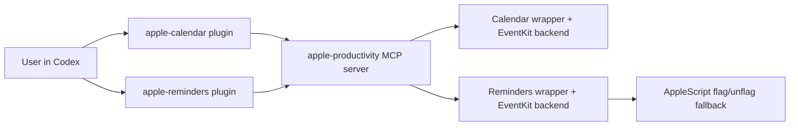

# Architecture

This repository is intentionally split into two layers:

1. `plugins/`
2. `mcp/`

That separation is the main design decision in the project.

## Layers

### Plugin Layer

Path:

- `plugins/apple-calendar`
- `plugins/apple-reminders`

Responsibilities:

- Codex-facing plugin manifests
- skill instructions
- user-friendly CLI entrypoints
- local config and aliases
- `.mcp.json` wiring to the shared MCP layer

This is the layer a Codex user interacts with directly.

### MCP Layer

Path:

- `mcp/apple-productivity`

Responsibilities:

- one shared stdio MCP server
- common tool surface for Calendar and Reminders
- a stable transport boundary for future clients

This is infrastructure, not the primary user-facing UX.

## Runtime Flow

## Calendar Path

Files:

- `plugins/apple-calendar/scripts/apple_calendar.py`
- `plugins/apple-calendar/scripts/apple_calendar_backend.swift`

Design:

- Python wrapper keeps the CLI and plugin-friendly ergonomics
- Swift/EventKit backend handles data operations and mutations
- recurring event operations are performed with EventKit spans
- `.ics` import/export is handled in the Python wrapper

Why this split:

- Python is easier for CLI parsing, file IO, and repo-local scripting glue
- EventKit is the correct macOS-native API for calendar objects

## Reminders Path

Files:

- `plugins/apple-reminders/scripts/apple_reminders.py`
- `plugins/apple-reminders/scripts/apple_reminders_backend.swift`

Design:

- Python wrapper owns the CLI UX and search/update orchestration
- Swift/EventKit backend handles reminder fetch and mutation flows
- AppleScript is used only for `flag` and `unflag`

Why the AppleScript fallback exists:

- EventKit does not expose the flagged property for reminders

## MCP Server Path

Files:

- `mcp/apple-productivity/server/apple_productivity_mcp.py`
- `mcp/apple-productivity/mcp.template.json`

Design:

- the MCP server is a thin orchestration layer
- it reuses the same Calendar and Reminders wrappers already used by the plugins
- it exposes one coherent tool surface to MCP-aware clients

Why this is better than duplicating logic:

- one backend path for plugin usage
- one backend path for MCP usage
- fewer drift bugs between “plugin mode” and “MCP mode”

## Installation Model

Installer:

- `scripts/install_local_plugins.py`

What it does:

- rewrites plugin `.mcp.json` files to the real clone path
- generates `mcp/apple-productivity/mcp.local.json`
- leaves the repo otherwise transparent and local

Why use placeholders in git:

- the repository stays portable
- no machine-specific absolute paths are committed

## Smoke Test Model

Files:

- `scripts/smoke_test_apple_cli.py`
- `scripts/smoke_test_apple_mcp.py`

Coverage:

- CLI lifecycle flows for Calendar and Reminders
- MCP initialize, tools listing, and selected tool calls
- recurring items
- `.ics` round-trip

Cleanup policy:

- tests create temporary artifacts
- tests delete those artifacts at the end

## Design Tradeoffs

### Why not only plugins?

Because plugins are excellent for Codex UX, but they are not the best long-term integration boundary if you later want:

- other MCP clients
- a future ChatGPT app
- one shared tool transport layer

### Why not only MCP?

Because the plugin layer still adds real value:

- better skill prompts
- human-friendly CLI usage
- Codex-native discoverability

### Why keep both?

Because the combination is stronger than either one alone:

- `plugins/` for direct daily usage
- `mcp/` for reusable infrastructure

## Permission Model

These features require macOS permissions for the app running Codex:

- Calendar
- Reminders

Without those permissions:

- EventKit operations fail
- AppleScript fallback operations fail

## Future Expansion

This layout makes these next steps straightforward:

- additional Apple productivity domains
- a future ChatGPT app over the MCP layer
- more smoke/integration coverage
- packaging or installer automation for wider distribution
